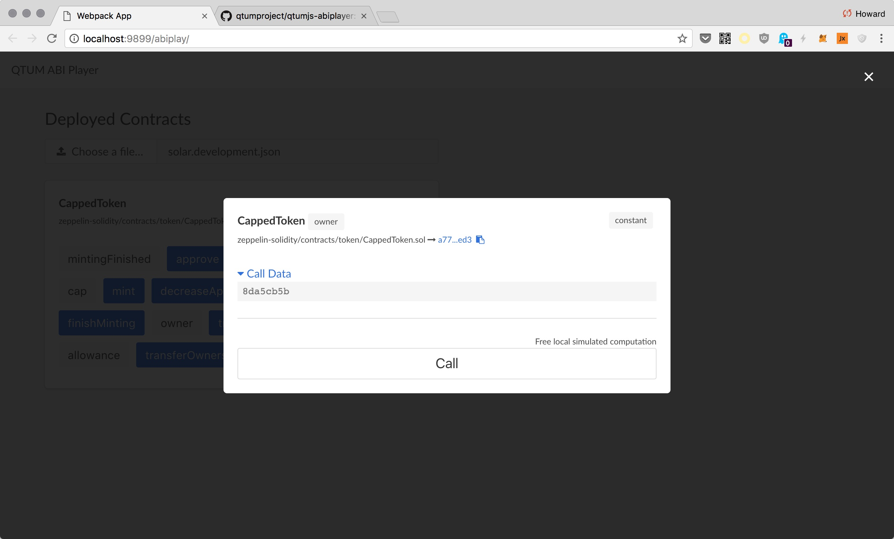
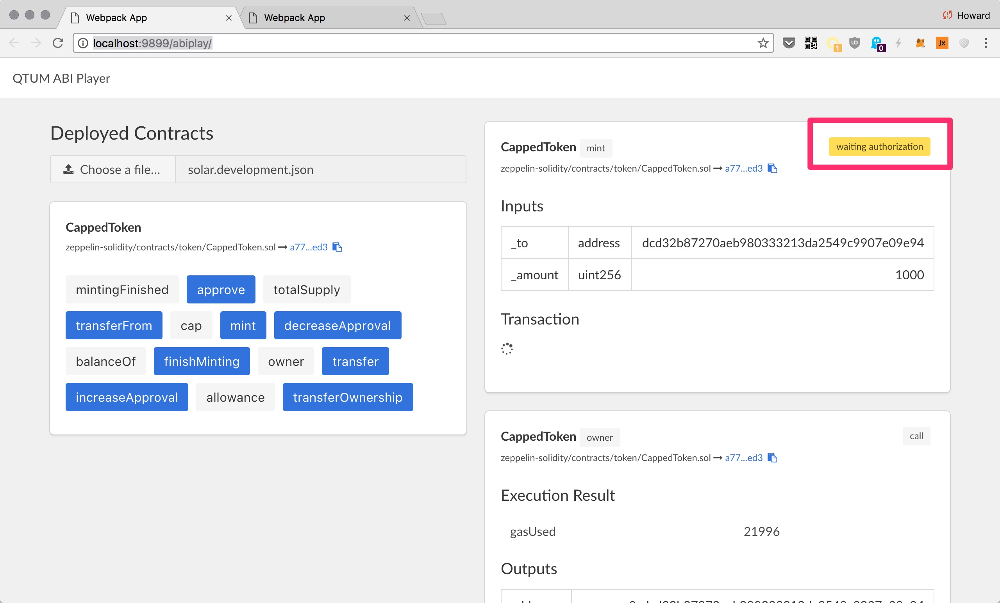

# ERC20 Token

In this chapter we will deploy an ERC20 token on QTUM. All ERC20 compliant token contracts support a common set of methods:

```
contract ERC20 {
    function totalSupply() constant returns (uint totalSupply);
    function balanceOf(address _owner) constant returns (uint balance);
    function transfer(address _to, uint _value) returns (bool success);
    function transferFrom(address _from, address _to, uint _value) returns (bool success);
    function approve(address _spender, uint _value) returns (bool success);
    function allowance(address _owner, address _spender) constant returns (uint remaining);

    event Transfer(address indexed _from, address indexed _to, uint _value);
    event Approval(address indexed _owner, address indexed _spender, uint _value); }
}
```

Because all tokens share the same interface, it is much easier for wallets and exchanges to support all the different tokens out there in the wild.

In what follows, we will deploy the
[CappedToken](https://github.com/OpenZeppelin/zeppelin-solidity/blob/4ce0e211c500aa756120c4f2851cc75518123309/contracts/token/CappedToken.sol), implemented by [OpenZeppelin](https://github.com/OpenZeppelin). We won't need to modify the contract in any way to make it work on QTUM.

The `CappedToken` is an ERC20 compliant token, inheriting the basic functionalities from both [StandardToken](https://github.com/OpenZeppelin/zeppelin-solidity/blob/4ce0e211c500aa756120c4f2851cc75518123309/contracts/token/StandardToken.sol) and [MintableToken](https://github.com/OpenZeppelin/zeppelin-solidity/blob/master/contracts/token/MintableToken.sol).

In particular,

+ `StandardToken` implements the ERC20 interface.
+ `MintableToken` adds the `mint(address _to, uint256 _amount)` method, to create new tokens out of thin air.
+ `CappedToken` adds limit to the max supply of tokens that could be minted.

# Deploy CappedToken

Create the project directory, and clone the [zeppelin-solidity](https://github.com/OpenZeppelin/zeppelin-solidity) repository to the project directory:

```
mkdir mytoken && cd mytoken

git clone https://github.com/OpenZeppelin/zeppelin-solidity.git
```

For this exercise, we'll start `qtumd` from scratch, in regtest mode:

```
docker run -it --rm \
  --name myapp \
  -v `pwd`:/dapp \
  -p 9899:9899 \
  -p 9888:9888 \
  hayeah/qtumportal
```

Enter into the container:

```
docker exec -it myapp sh
```

Generate some initial balance:

```
qcli generate 600
```

## Deploy Contract

The `CappedToken` constructor requires the `_capacity` parameter, to specify the maximum number of tokens we can mint:

```
function CappedToken(uint256 _capacity)
```

It takes quite a few steps to deploy a contract:

1. Use the [solidity compiler](https://github.com/ethereum/solidity) to compile the contract into bytecode.
2. [ABI encode](https://github.com/ethereum/wiki/wiki/Ethereum-Contract-ABI) the `_capacity` parameter into bytes.
3. Concatenate 1 and 2 together, then make a `createcontract` RPC call to qtumd.
4. Wait for transaction to confirm.
5. Record the address of the contract, and owner of the contract, for later uses.

The [solar](https://github.com/qtumproject/solar.git) Smart Contract deployment tool (included in the container) handles all of this for you.

To deploy the CappedToken contract, specifying 21 million as the capacity by passing in the constructor parameters as a JSON array:

```
solar deploy zeppelin-solidity/contracts/token/CappedToken.sol \
  '[21000000]'
```

Then solar waits for confirmation:

```
🚀  All contracts confirmed
   deployed zeppelin-solidity/contracts/token/CappedToken.sol =>
      a778c05f1d0f70f1133f4bbf78c1a9a7bf84aed3
```

The contract had been deployed to `a778c05f1d0f70f1133f4bbf78c1a9a7bf84aed3`. (You'd get a different contract address).

The `solar status` command lists all contracts that had been deployed with solar:

```
solar status

✅  zeppelin-solidity/contracts/token/CappedToken.sol
        txid: 58bbe3b39adeccdce5cfca5e8b284224da9fcd32c00b2147aecd0a0438735c11
     address: a778c05f1d0f70f1133f4bbf78c1a9a7bf84aed3
   confirmed: true
       owner: qdgznat81MfTHZUrQrLZDZteAx212X4Wjj
```

Note that the contract has an `owner`. This is the address of the UTXO used to create this contract. We'll see in just a bit how you can act as the owner of this contract, to perform administrative tasks protected by the `onlyOwner` modifier.

You can find information about the deployed contracts in `solar.development.json`.

# The Owner UTXO Address

The main difference between QTUM and Ethereum is that QTUM is built on Bitcoin's UTXO model, and Ethereum has its own account model, as we've seen in the [QTUM UTXO](../part1/UTXOs-balances.md) chapter.

The implication is that each time a contract is deployed a different UTXO from the wallet is used, and that UTXO becomes the "owner" of the contract. In other words, the address of the UTXO that is spent is the `msg.sender` of a transaction.

Now, let's look at the method `mint`:

```
function mint(address _to, uint256 _amount) onlyOwner canMint public returns (bool)
```

We see that the method is protected by the `onlyOwner` modifier, which checks whether the `msg.sender` is the contract's `owner`

```
modifier onlyOwner() {
  require(msg.sender == owner);
  _;
}
```

https://github.com/OpenZeppelin/zeppelin-solidity/blob/4ce0e211c500aa756120c4f2851cc75518123309/contracts/ownership/Ownable.sol#L28

To satisfy this modifier, we'll need to call the method using the UTXO address that created the contract. But the owner UTXO was already spent when we created the contract. We can't use it again to make another method call!

The way to get around this problem is to create a new UTXO with the same address, endowing it with enough value to pay for the transaction we want to make. Since UTXO can be used once only, you'll need to generate an UTXO for each transaction.

This is slightly more cumbersome than in Ethereum, where the account has a balance, and each transaction simply reduces the account balance.

## Prefunding The Owner Address

OK, so to act as the owner of a contract, we need to create UTXOs that share the same address as the owner address.

So the owner address is `qdgznat81MfTHZUrQrLZDZteAx212X4Wjj`. We could send 1 qtum to it:

```
qcli sendtoaddress qdgznat81MfTHZUrQrLZDZteAx212X4Wjj 1
```

If we need many UTXOs, we can create them more efficiently in one single transaction by using the `sendmanywithdupes` RPC call.

The `solar prefund` command is a more convenient wrapper for `sendmanywithdupes` to create the UTXOs. To create 20 UTXOs of 1 qtum each for the address `qdgznat81MfTHZUrQrLZDZteAx212X4Wjj`:

```
solar prefund qdgznat81MfTHZUrQrLZDZteAx212X4Wjj 1 20
```

Or equivalently, you can use the name of the deployed contract:

```
solar prefund zeppelin-solidity/contracts/token/CappedToken.sol 1 20
```

Wait for the transaction to confirm, then you can check if the UTXOs had been created:

```
qcli listunspent 0 10 '["qdgznat81MfTHZUrQrLZDZteAx212X4Wjj"]'

[
  ...

  {
    "txid": "fe77d9c01ab72e22b83180aa485aabb6ac3814edf853c986ce0e0bf532fffcfa",
    "vout": 19,
    "address": "qdgznat81MfTHZUrQrLZDZteAx212X4Wjj",
    "scriptPubKey": "76a914dcd32b87270aeb980333213da2549c9907e09e9488ac",
    "amount": 1.00000000,
    "confirmations": 3,
    "spendable": true,
    "solvable": true
  },
  {
    "txid": "fe77d9c01ab72e22b83180aa485aabb6ac3814edf853c986ce0e0bf532fffcfa",
    "vout": 20,
    "address": "qdgznat81MfTHZUrQrLZDZteAx212X4Wjj",
    "scriptPubKey": "76a914dcd32b87270aeb980333213da2549c9907e09e9488ac",
    "amount": 1.00000000,
    "confirmations": 3,
    "spendable": true,
    "solvable": true
  }
]
```

You can see that these UTXOs share the same address `qdgznat81MfTHZUrQrLZDZteAx212X4Wjj`.

# Using ABIPlayer

The `solar.development.json` file stores information about the deployed CappedToken contract. You can load this file into the ABIPlayer to interact with any contracts deployed with solar.

Make sure that the docker container is running, and visit: http://localhost:9899/abiplay/


Load the file, and you should see a list of available contracts and methods:


The gray buttons are readonly methods (call only). The blue buttons support both send and call.

Let's click on the `owner` button, to get the `owner` of this contract:



And we see the owner address returned as a hexadecimal address:


We can convert it back to the base58 UTXO address:

```
qcli fromhexaddress dcd32b87270aeb980333213da2549c9907e09e94

qdgznat81MfTHZUrQrLZDZteAx212X4Wjj
```

# Mint With ABIPlayer

Let's mint some coins for the contract owner! Because we are sending the receiver address into the smart contract, we'll need to format the address in hexadecimal instead of base58.

To mint 1000 tokens:


Click send, and you'll see that the transaction is waiting for authorization:



This request requires your authorization because it costs QTUM. Visit the authorization UI (http://localhost:9899/) to approve it:


Wait for confirmation, and you should see information about the transaction:


You may now call `balanceOf` and `totalSupply` to check if the owner had received the minted tokens, and that the supply had increased accordingly:


# Conclusion

In this chapter we have deployed a basic ERC20 token, and encounter a few tools along the way:

+ `solar deploy` to compile & create a contract.
+ `solar prefund` to create UTXOs that has the same address as the contract owner.
+ Use ABIPlayer to interact with deployed contracts: http://localhost:9899/abiplay/
+ Authorize requests that cost money: http://localhost:9899/

