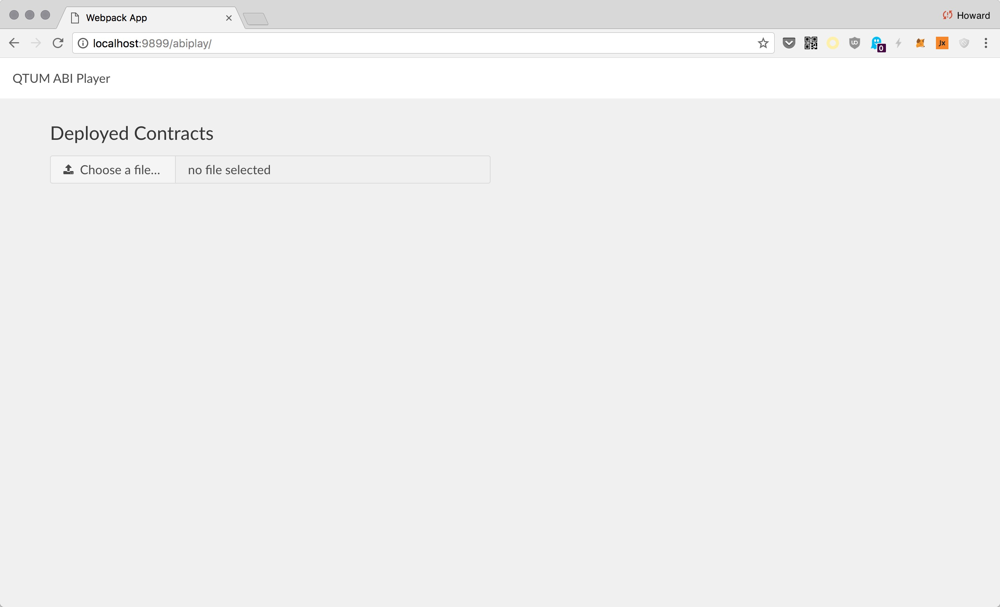
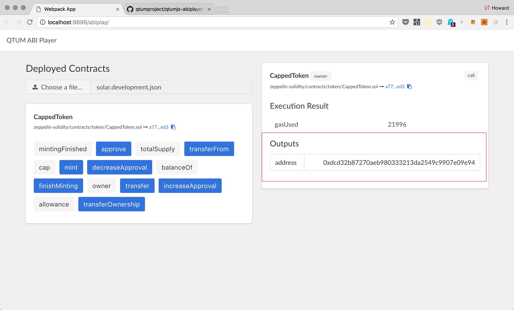
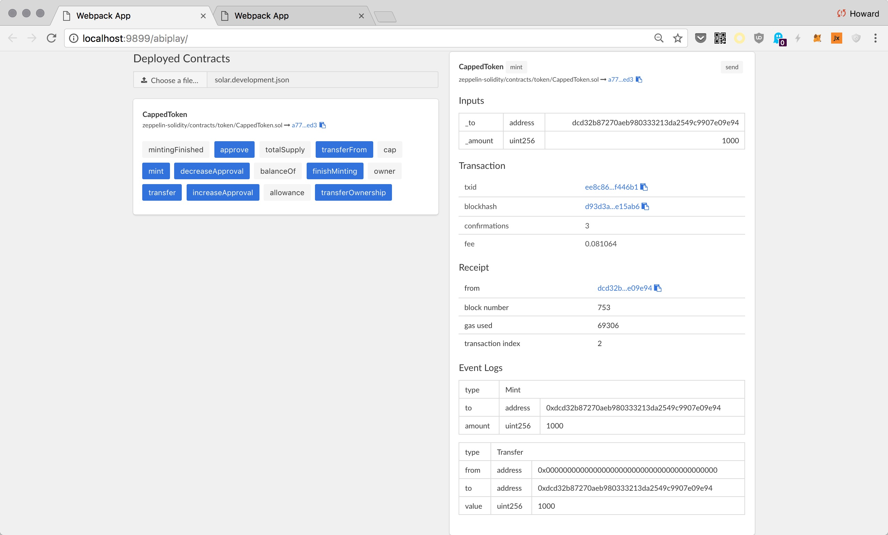

# ERC20 Token

本章中，我们将在QTUM上部署一个ERC20 token。所有遵循ERC20标准的token都支持一组通用的方法：

```
contract ERC20 {
    function totalSupply() constant returns (uint totalSupply);
    function balanceOf(address _owner) constant returns (uint balance);
    function transfer(address _to, uint _value) returns (bool success);
    function transferFrom(address _from, address _to, uint _value) returns (bool success);
    function approve(address _spender, uint _value) returns (bool success);
    function allowance(address _owner, address _spender) constant returns (uint remaining);

    event Transfer(address indexed _from, address indexed _to, uint _value);
    event Approval(address indexed _owner, address indexed _spender, uint _value); }
}
```

所有的token拥有相同的接口，因此钱包和交易所可以更方便地支持所有不同种类的token。

接下来，我们将部署
[CappedToken](https://github.com/OpenZeppelin/zeppelin-solidity/blob/4ce0e211c500aa756120c4f2851cc75518123309/contracts/token/CappedToken.sol)，使用 [OpenZeppelin](https://github.com/OpenZeppelin)实现。不需要对合约进行任何的修改就可以使其运行在QTUM上。

`CappedToken`是一种遵循ERC20标准的token，它继承了[StandardToken](https://github.com/OpenZeppelin/zeppelin-solidity/blob/4ce0e211c500aa756120c4f2851cc75518123309/contracts/token/StandardToken.sol) 和 [MintableToken](https://github.com/OpenZeppelin/zeppelin-solidity/blob/master/contracts/token/MintableToken.sol) 的基本功能。

具体地，

+ `StandardToken` 实现了ERC20的接口。
+ `MintableToken` 添加了 `mint(address _to, uint256 _amount)` 方法用于创造新的token。
+ `CappedToken` 对可铸造的token的最大供应量进行了限制。

# 部署CappedToken

创建project目录，并将 [zeppelin-solidity](https://github.com/OpenZeppelin/zeppelin-solidity) 库复制到project目录下：

```
mkdir mytoken && cd mytoken

git clone https://github.com/OpenZeppelin/zeppelin-solidity.git
```

对于这个练习，我们将从头开始。首先以regtest模式启动`qtumd`：

```
docker run -it --rm \
  --name myapp \
  -v `pwd`:/dapp \
  -p 9899:9899 \
  -p 9888:9888 \
  hayeah/qtumportal
```

进入容器：

```
docker exec -it myapp sh
```

生成一些初始的余额：

```
qcli generate 600
```

# Owner地址

一个特定的UTXO地址将会拥有我们部署的ERC20 token。为了使token只能被合约的owner所使用，ERC20中使用了一些管理method。

这些method由`onlyOwner` modifier（修改器）进行保护，onlyOwner modifier可以检查`msg.sender`是否为合约的`owner`:

```
modifier onlyOwner() {
  require(msg.sender == owner);
  _;
}
```

例如，`mint`函数可以确保只有owner才能使用token：

```
function mint(address _to, uint256 _amount) onlyOwner canMint public returns (bool)
```

## 创建Owner地址并给它发送资金

首先生成一个地址作为owner的地址：

```
qcli getnewaddress
qdgznat81MfTHZUrQrLZDZteAx212X4Wjj
```

这个地址没有什么特别之处，开发者也可以使用钱包中任意一个地址。

给这个owner地址发送10个QTUM的资金，用于后面部署合约时支付gas费用：

```
qcli sendtoaddress qdgznat81MfTHZUrQrLZDZteAx212X4Wjj 10
cf652f54e6a6dde3e60fa4e38eee1c529bf4ecf3f8424c7ac7ef9717850cc984
```

支付被确认后，就能查询到该owner地址上有一个UTXO：

```
qcli listunspent 1 99999 '["qdgznat81MfTHZUrQrLZDZteAx212X4Wjj"]'
[
  {
    "txid": "cf652f54e6a6dde3e60fa4e38eee1c529bf4ecf3f8424c7ac7ef9717850cc984",
    "vout": 1,
    "address": "qdgznat81MfTHZUrQrLZDZteAx212X4Wjj",
    "account": "",
    "scriptPubKey": "76a91437158152a9768477770ecb7a9e55a5875b9f35b088ac",
    "amount": 10.00000000,
    "confirmations": 1,
    "spendable": true,
    "solvable": true
  }
]
```

最后，配置部署工具`solar`使该特定地址成为合约的owner：

```
export QTUM_SENDER=qdgznat81MfTHZUrQrLZDZteAx212X4Wjj
```

现在就可以开始部署token合约了。

## 部署Token合约

`CappedToken`构造函数需要`_capacity`参数来指定可以铸造的token的最大数量：

```
function CappedToken(uint256 _capacity)
```

部署一个合约通常需要以下几个步骤：

1. 使用 [solidity compiler](https://github.com/ethereum/solidity) 将合约编译成bytecode（字节码）。
2. [ABI encode](https://github.com/ethereum/wiki/wiki/Ethereum-Contract-ABI) 将`_capacity`参数编码成字节。
3. 将1和2连接在一起，然后对qtumd进行一个`createcontract` RPC（远程过程调用）调用。
4. 等待交易被确认。
5. 记录合约的地址以及合约的owner，供后续使用。

智能合约部署工具 [solar](https://github.com/qtumproject/solar.git) （置于容器内的）会处理所有上述步骤。

部署CappedToken合约时，通过在构造函数参数中传递一个JSON数组，指定该合约的容量为2100万 (记住要设置`QTUM_SENDER`):

```
solar deploy zeppelin-solidity/contracts/token/ERC20/CappedToken.sol \
  '[21000000]'
```

然后solar等待确认：

```
🚀  All contracts confirmed
   deployed zeppelin-solidity/contracts/token/CappedToken.sol =>
      a778c05f1d0f70f1133f4bbf78c1a9a7bf84aed3
```

现在，合约已经部署到`a778c05f1d0f70f1133f4bbf78c1a9a7bf84aed3`地址上了。（在自己电脑上操作时，你可能会得到一个不同的地址）。

`solar status`命令可以用于显示所有使用solar部署的合约：

```
solar status

✅  zeppelin-solidity/contracts/token/CappedToken.sol
        txid: 457a5afe15686c0bd596635aeb78d4ff7d2bf6a75df66c7251e89ce4d9c8f6d3
     address: 3db297ee4c225b45219d2a7aa68afea7f4e68832
   confirmed: true
       owner: qdgznat81MfTHZUrQrLZDZteAx212X4Wjj
```

注意，合约的owner应该被设置为我们前面提到的`QTUM_SENDER` 值。如果没有设置`QTUM_SENDER`，那么就会从钱包中随机选择一个UTXO作为合约的owner。

在`solar.development.json`中，可以找到关于已部署合约的更多信息。

# Owner的UTXO地址作为发送方

QTUM和以太坊的主要区别就是QTUM是基于比特币的UTXO模型，而以太坊有自己的账户模型，这点我们在前面的 [QTUM UTXO](../part1/UTXOs-balances.md) 章节中已经提到了。

在以太坊中，交易的花费由账户进行支付。支付的金额会从账户中扣除，但是账户仍然存在。

然而，UTXO只能被使用一次。因此，我们之前使用的是一个UTXO来部署合约，该UTXO的地址为`qdgznat81MfTHZUrQrLZDZteAx212X4Wjj`。现在该UTXO已经消失，它的全部金额也被花光。

因此每次作为一个合约的owner，就会毁灭这个owner的UTXO。下次想要成为该合约的owner，将需要一个有着相同地址的新的UTXO。如果这些都需要手动操作，那将是很烦人的。

幸运的是，在与合约交互时，QTUM总是创建一个有着相同地址的新的UTXO来替换已经使用的UTXO。

列出owner地址`qdgznat81MfTHZUrQrLZDZteAx212X4Wjj`对应的UTXO。可以看到，即使我们已经花费了一个UTXO，这里仍然只有一个UTXO：

```
qcli listunspent 1 99999 '["qdgznat81MfTHZUrQrLZDZteAx212X4Wjj"]'
[
  {
    "txid": "457a5afe15686c0bd596635aeb78d4ff7d2bf6a75df66c7251e89ce4d9c8f6d3",
    "vout": 1,
    "address": "qdgznat81MfTHZUrQrLZDZteAx212X4Wjj",
    "account": "",
    "scriptPubKey": "76a91437158152a9768477770ecb7a9e55a5875b9f35b088ac",
    "amount": 8.78777200,
    "confirmations": 61,
    "spendable": true,
    "solvable": true
  }
]
```

然而，注意到交易id `457a...f6d3` 和之前的UTXO 的交易id`cf65...c984`是不相同的。这是一个完全不同的UTXO，并且它的金额为10减去为部署合约支付的费用。

金额`8.78777200`为找回的零钱（change）。对于一个与合约有交互的交易，找零（change）是支付给发送方的。而在一个典型的支付交易中，找零是支付给一个由钱包控制的新生成的地址。

其结果是，尽管比特币UTXO和以太坊账户的记账模型差别很大，但是在QTUM中，两者的行为方式很类似。

# 使用ABIPlayer

`solar.development.json`文件存储了关于已部署的CappedToken合约的信息。开发者可以将该文件加载到ABIPlayer中，这样就可以和使用solar部署的任何合约进行交互。

确保docker容器正在运行，访问：[http://localhost:9899/abiplay/](http://localhost:9899/abiplay/)



加载solar.development.json文件后，可以看到可用的合约以及method的列表：


灰色按钮是只读的method（只能call（调用）），而蓝色按钮对应的method既支持send（发送）也支持call（调用）。

点击`owner`按钮，获取该合约的`owner`信息：


可以看到，返回的owner地址为一个十六进制地址：



可以将其转换回base58编码的UTXO地址:

```
qcli fromhexaddress dcd32b87270aeb980333213da2549c9907e09e94

qdgznat81MfTHZUrQrLZDZteAx212X4Wjj
```

# 使用ABIPlayer铸造token

下面让我们为合约的owner铸造一些币。由于接收方的地址需要发送给智能合约，因此地址的格式应该转换为十六进制而不是base58编码格式。

铸造1000个token：


点击发送，你将看到交易正在等待授权（waiting authorization）：


这个请求需要你的授权，因为它会花费QTUM。访问授权UI([http://localhost:9899/](http://localhost:9899/))来批准该请求：


等待确认，并且你将看到交易信息，如下：



现在，可以调用`balanceOf`和`totalSupply`检查owner是否已经接收到token，以及供应量是否相应地增加了：


# 总结

在本章中，我们部署了一个基本的ERC20 token，并且在此过程中，我们使用了一些工具：

+ `solar deploy` 编译&创建一个合约。
+ `solar prefund` 创建和合约owner具有相同地址的UTXOs。
+ 使用ABIPlayer和已部署的合约进行交互：[http://localhost:9899/abiplay/](http://localhost:9899/abiplay/)
+ 对花费资金的请求进行授权：[http://localhost:9899/](http://localhost:9899/)

