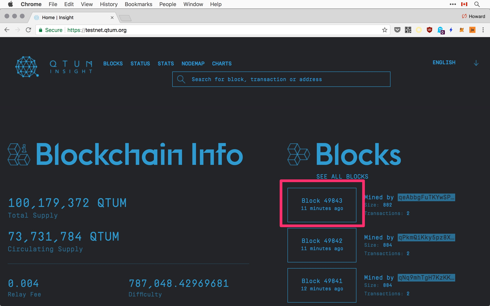

# 测试网和主网

`regtest`模式对于本地开发是非常方便的，但是最终开发者还是会想要在实际网络中测试智能合约和DApp。

# 连接到测试网络

docker容器根据指定的`QTUM_NETWORK`连接到不同的网络。默认情况下，是使用 `regtest`。要连接到测试网络，则使用`testnet`：

```
docker run -it --rm \
  --name myapp \
  -e "QTUM_NETWORK=testnet" \
  -v `pwd`:/dapp \
  -p 9899:9899 \
  -p 9888:9888 \
  -p 3889:3889 \
  -p 13888:13888 \
  hayeah/qtumportal
```

* `-p 13888:13888` 是测试网络的P2P端口，以便其他节点可以和该节点连接。

从网络上下载区块数据需要一些时间。你将看到如下的日志消息：

```
06:41:56  qtumd | 2017-12-14 06:41:56 UpdateTip: new best=000054cbb176ed62b2f6fc335204bee4b7ce5f658b8f7cfff6961c25c9a54cf9 height=2094 version=0x20000003 log2_work=27.032757 tx=2095 date='2017-09-08 05:50:54' progress=0.000638 cache=0.4MiB(2094txo)
06:41:56  qtumd | 2017-12-14 06:41:56 ProcessNetBlock: ACCEPTED
06:41:56  qtumd | 2017-12-14 06:41:56 UpdateTip: new best=0000924e3af343bd41f0476b92aeef4e46d748db436d5a5074f337989b7ffba7 height=2095 version=0x20000003 log2_work=27.033445 tx=2096 date='2017-09-08 05:50:54' progress=0.000638 cache=0.4MiB(2095txo)
06:41:56  qtumd | 2017-12-14 06:41:56 ProcessNetBlock: ACCEPTED
06:41:56  qtumd | 2017-12-14 06:41:56 UpdateTip: new best=0000bf6616615286a786f0ec59c3881f48e1b1a49367779f33753a027b099c31 height=2096 version=0x20000003 log2_work=27.034133 tx=2097 date='2017-09-08 05:50:54' progress=0.000638 cache=0.4MiB(2096txo)
06:41:56  qtumd | 2017-12-14 06:41:56 ProcessNetBlock: ACCEPTED

// synchronizing with network...
```

* `progress` 随着本地节点越接近网络，progress的值越接近1.0（100%）。
* `height` 已经同步的最新的区块。

查看关于测试网络的一些信息，可以访问 [Testnet Block Explorer](https://testnet.qtum.org/)。特别是，它列出了最近被挖出来的区块，这样可以方便开发者大致了解自己在同步过程中的进程。



截止到2017年12月中旬，区块的高度大约为50000个。

# 获取测试网代币(Token)

对于测试网，无法通过生成或者挖掘新的区块来获取token，但是可以向测试网络faucet请求一些免费的token：

http://testnet-faucet.qtum.info

首先生成一个新的支付地址：

```
qcli getnewaddress

qcf3Yv72SbLvVDmU99BMf5T1YwvdvA3fx6
```

然后将其复制到输入框中：


http://testnet-faucet.qtum.info

一旦被接受，就能在最近的支付列表中看到你的地址和金额：


点击该支付地址，可以看到一个用来查看测试网区块浏览器中的交易的链接：


[https://testnet.qtum.org/address/qcf3Yv72SbLvVDmU99BMf5T1YwvdvA3fx6](https://testnet.qtum.org/address/qcf3Yv72SbLvVDmU99BMf5T1YwvdvA3fx6)

疯狂地点击ctrl-r，一次又一次地刷新浏览器，这样有助于网络更快地确认交易（实际并不能加快，但通过刷新你可以第一时间获得确认信息）。一旦交易确认了，你可以在本地检查余额：

```
qcli getbalance

94.00000000
```

同样也可以看到为该金额创建的UTXO：

```
qcli listunspent

[
  {
    "txid": "2a8997d398633bc01c97fc623a59aaca4f678caf2d3949f4679e1f0f5952479f",
    "vout": 0,
    "address": "qcf3Yv72SbLvVDmU99BMf5T1YwvdvA3fx6",
    "account": "",
    "scriptPubKey": "76a914d17c851679a8ca558d9d783643cc926f7a382e7888ac",
    "amount": 94.00000000,
    "confirmations": 23,
    "spendable": true,
    "solvable": true
  }
]
```

但是，很抱歉，没有http://faucet.qtum.info : p

# 主网

要连接到主网上，可以设置`QTUM_NETWORK=mainnet`:

```
docker run -it --rm \
  --name myapp \
  -e "QTUM_NETWORK=mainnet" \
  -v `pwd`:/dapp \
  hayeah/qtumportal
```

注意，我们去掉了`-p`标志，这样，网络端口就不能在容器之外访问。

通过shell进入容器内的开发方法是更安全的：

```
docker exec -it myapp sh
```

