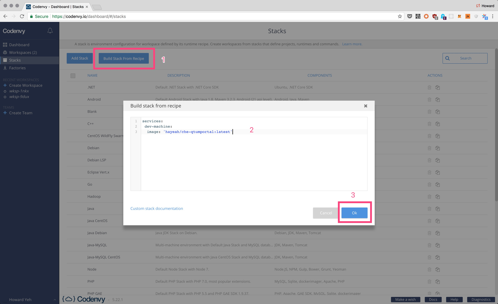
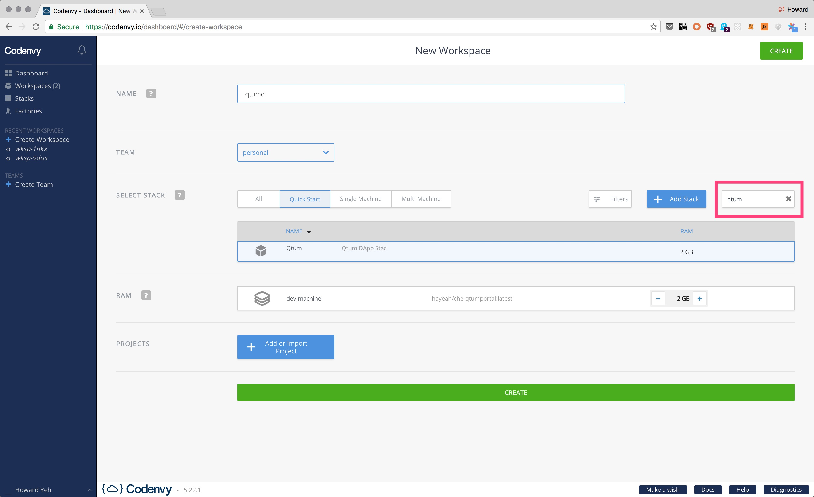

# 使用Codenvy集成开发环境开发QTUM

如果你的电脑上没有安装docker，可以在https://codenvy.io上注册一个账号。它可以提供一个可在浏览器中使用的编程环境，而无需安装任何东西。这是最简单的在QTUM上进行开发的方法。

首先，在https://codenvy.io/dashboard/#/stacks网页中点击“Build Stack From Recipe”按钮。

粘贴下列recipe：

```
services:
 dev-machine:
  image: 'hayeah/che-qtumportal:latest'
```



然后编辑stack的名称和描述，并且点击“save”按钮创建一个stack（例如，QTUM编程环境规范）：


一旦在recipe中创建了stack，访问https://codenvy.io/dashboard/#/create-workspace创建一个工作空间（例如，一个实际的qtum编程环境）：



大概需要1分钟的时间启动。Codenvy的编程用户界面如下：


通过运行`qcli getinfo`命令来验证环境是否正常工作：


