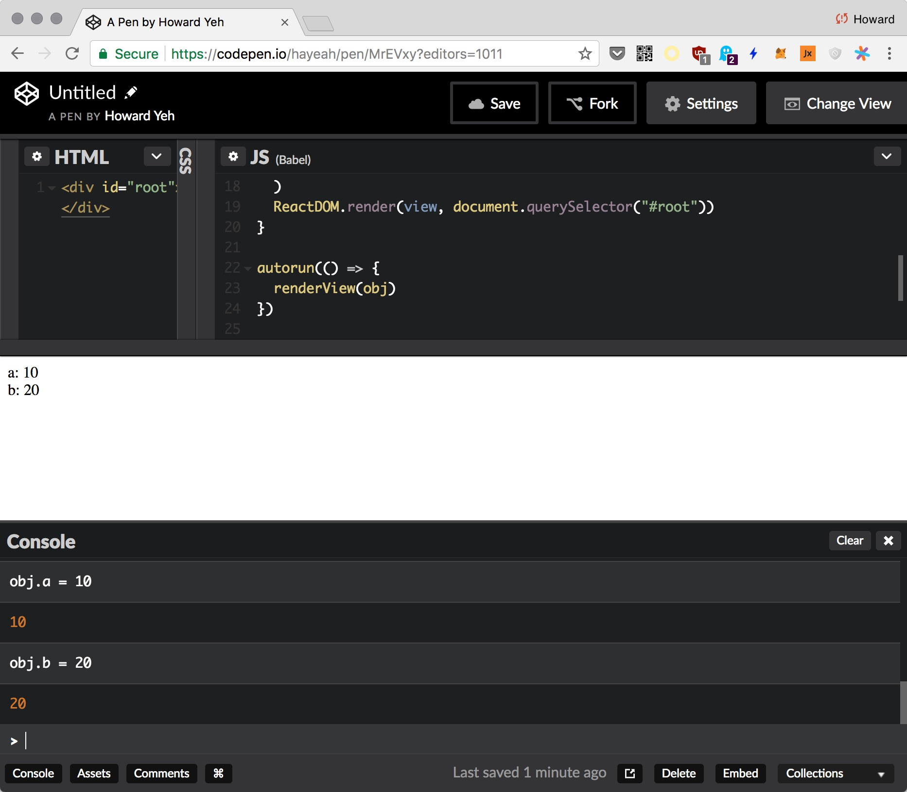
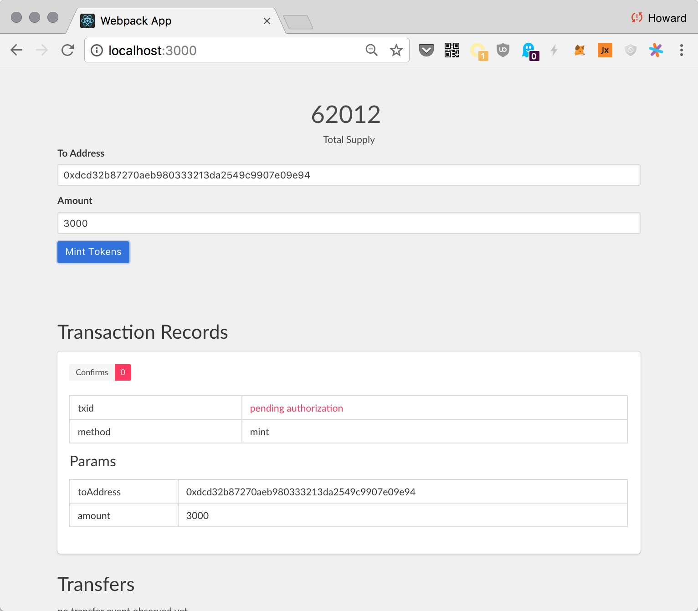
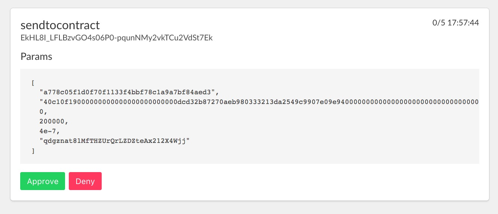

# ERC20 DApp

在本章中，我们将为 [前面部署的ERC20 Token](./erc20-token.md) 构建一个对应的DApp。

该DApp的特性和我们已经构建的NodeJS CLI工具的特性类似。DApp 需要做到以下几点：

+ 订阅和显示token transfer events。
+ 显示总供应量，并且自动更新该值。
+ 能够铸造新的token。
+ 显示交易相关信息，例如交易确认的次数。

DApp看起来应该是像这样的：


唯一不同的一点是，DApp在没有得到用户允许的情况下不能创建交易。因此，对于每笔交易，应该给用户一个选择机会，是批准还是拒绝它：


ERC20 DApp相比CLI App更复杂，用为DApp需要追踪多笔交易，并且在新的确认出现时需更新UI。

本书中使用 [mobx.js](https://mobx.js.org/)，一种响应式的编程框架，可以保持数据和视图同步。

开发者可以从 [qtumproject/qtumjs-dapp-erc20](https://github.com/qtumproject/qtumjs-dapp-erc20)中获取代码，并使用它来启动自己的DApp项目。

# 响应式编程简介

GUI编程的复杂性大部分在于同步底层数据和UI状态。当数据发生改变时，UI也需要改变。反过来，当UI发生改变（比如用户输入一个数字）时，数据也需要改变。

让UI和数据保持同步是很繁琐且容易出错的。

将UI和数据绑定在一起会很好，这样它们总是一起改变。`mobx`就提供了实现这一功能的工具，非常神奇。

首先，我们看看在没有响应式编程的情况下，如何手动地更新UI。然后再看看mobx是如何自动化实现该过程。

## 手动更新UI

假设数据是：

```js
const obj = {
  a: 1,
  b: 2,
}
```

在一个功能为视图渲染的函数中读取该数据：

```jsx
function renderView(obj) {
  const view = (
    <div>
      a: {obj.a}
      <br/>
      b: {obj.b}
    </div>
  )
  ReactDOM.render(view, document.querySelector("#root"))
}
```

然后更新数据：

```js
obj.a = 10
```

下一步，需要再次手动地调用`renderView`进行更新：

```js
renderView(obj)
```

如果我们忘记了重新渲染，视图就没有更新。在一个复杂的应用程序中，可能会有许多使用不同数据块的不同视图，正确地记录所有数据和对应的视图是一个很大的挑战。

## 响应式的UI更新

我们希望在修改对象时，`renderView`会被自动调用，而不需要手动调用，就像这样：

```js
obj.a = 10
// ✨✨✨ the view automagically updates ✨✨✨
```

为了实现这一点，`mobx`引入了两个神奇的功能：

+ [observable](https://mobx.js.org/refguide/observable.html): 如果修改了一个observable对象，那么依赖于该对象数据的代码会自动重新运行。
* [autorun](https://mobx.js.org/refguide/autorun.html): 执行一段代码，并追踪所使用的所有observable数据。如果发生任何改变，就重新运行。

将前面的例子修改成如下形式：

```js
// Turn an object into an observable
const obj = observable({
  a: 1,
  b: 2,
})
```

并且使用`autorun`渲染UI，这样，当`obj`发生改变时它就会重新运行：

```js
// Will automatically run `renderView` if obj changes
autorun(() => {
  renderView(obj)
})
```

开发者可以 [try this example on codepen.io](https://codepen.io/hayeah/pen/MrEVxy?editors=1011)。在提供的console（控制台）修改`obj`，并查看视图的变化。




> 注意，在实际的响应式的代码中，我们不会显示地调用`autorun`，框架会自己处理。但是两者的思想是一样的，即修改一个对象，那么使用该对象的相关组件将自动进行重新渲染。

# Project运行

复制project:

```
git clone https://github.com/qtumproject/qtumjs-dapp-erc20.git
```

安装该project dependencies:

```
yarn install
# or: npm install
```

和nodejs CLI工具类似，我们需要已部署合约的相关信息。可以直接将`solar.development.json`文件复制/链接到该project中：

```
ln -s ~/qtumbook/examples/mytoken/solar.development.json solar.development.json
```

然后启动web服务器：

```
npm start

> qutm-portal-ui@0.0.1 start /Users/howard/p/qtum/qtumjs-dapp-erc20
> neutrino start

✔ Development server running on: http://localhost:3000
✔ Build completed
```

打开http://localhost:3000，你将看到：


## Project 结构

* [src/index.ts](https://github.com/qtumproject/qtumjs-dapp-erc20/blob/master/src/index.tsx): project的入口，可以进行一些设置。
* [src/views](https://github.com/qtumproject/qtumjs-dapp-erc20/tree/master/src/views): 该目录包含所有响应式的组件。
* [src/Store.ts](https://github.com/qtumproject/qtumjs-dapp-erc20/blob/master/src/Store.ts): 该observable对象管理应用程序的逻辑和数据。

`rpc`和`myToken`实例使用两个全局常量初始化：

```js
const rpc = new QtumRPC(QTUM_RPC)

const myToken = new Contract(rpc, SOLAR_REPO.contracts["zeppelin-solidity/contracts/token/CappedToken.sol"])
```

常量`QTUM_RPC`和`SOLAR_REPO` 在 [config/development.js](https://github.com/qtumproject/qtumjs-dapp-erc20/blob/master/config/development.js) 中定义。


# 显示总供应量

`Store`是一个observable对象。如果`totalSupply`属性发生改变，则使用它的响应式组件也会进行更新。

当App首次加载时，它会调用`updateTotalSupply`来获取总供应量。简化的`Store`代码如下：

```js
class Store {
  @observable public totalSupply: number = 0

  // `updateTotalSupply` is called when app is first loaded
  public async updateTotalSupply() {
    const result = await myToken.call("totalSupply")
    const supply = result.outputs[0]

    // Triggers update
    this.totalSupply = supply.toNumber()
  }
}
```

通过简单地设置`this.totalSupply`，使用它的视图就会重新进行渲染。具体来说，就是涉及JSX的这一部分：


```html
<h1>
  <span className="is-size-2"> {totalSupply} </span>
  <br />
  Total Supply
</h1>
```

https://github.com/qtumproject/qtumjs-dapp-erc20/blob/92d4aed5128ff5685e23bc1bb4e0b1842e0dccca/src/views/App.tsx#L28-L32

## Mint Events 订阅

下面，我们来订阅`Mint` event，这样当有人铸造了额外的token我们就可以立刻更新总供应量的数值。简化的代码如下：

```js
class Store {
  @observable.shallow public transferEvents: ITransferLog[] = []

  // `observeEvents` is called by `init`
  private async observeEvents() {
    this.emitter = myToken.logEmitter()

    this.emitter.on("Mint", () => {
      this.updateTotalSupply()
    })

    this.emitter.on("Transfer", (log: ITransferLog) => {
      this.transferEvents.unshift(log)
    })
  }
}
```

在这里，App对`Mint`和`Transfer` events都进行订阅，并且在通知订阅的event发生时进行一些相应的操作。

+ `Mint`: 更新总供应量。
+ `Transfer`: 将transfer event添加到一个数组中，这样就可以在UI中显示它。

渲染`transferEvents`的视图很简单：

```html
<h1> Transfers </h1>

{transferEvents.length === 0 && "no transfer event observed yet"}

{
  transferEvents.map((log) => <TransferLog key={log.transactionHash} log={log} />)
}
```

当一个新的item添加到`transferEvents`中，视图就会进行更新。

下面对这一点进行测试。使用NodeJS CLI铸造更多的token：

```
node index.js mint dcd32b87270aeb980333213da2549c9907e09e94 1000

mint tx: 7f0ff25475e2e6e0943fa6fb934999019d7a6a886126c220d0fa7cdcc3c36feb

✔ confirm mint
```

虽然铸币过程是在App外完成的，我们仍然会收到通知。总供应量应该增加1000，并且UI中会显示一个新的`Transfer` event：


# 交易的生命周期管理

在一个典型的web App中，用户点击一个按钮，App就向服务器发出一次HTTP请求并得到一个响应。这是一个简单地循环，并且用户不需要批准该HTTP请求，也不需要知道该请求是否被服务器接受。

一个交易的生命周期则有更多的阶段：

1. 交易等待用户审核和批准。
2. 将交易发送给qtumd，并在网络上进行广播。
3. 用户等待交易达到一定的确认次数。

App需要指示交易正处于上述阶段中的哪一阶段。

# 铸造Tokens

`mintTokens` method会追踪已经生成的铸币交易，并随着交易在其生命周期各个阶段的进展而更新UI。

该method的前半部分创建了一个新的observable对象`txRecord`。 后半部分更新txRecord，它反过来也会触发视图的更新。

`mintTokens`带注释的代码如下：

```js
public async mintTokens(toAddress: string, amount: number) {
  // `txRecords` is an observable array. Adding an object into the array
  // will recursively convert the object into an observable.
  this.txRecords.unshift({
    method: "mint",
    params: {
      toAddress,
      amount,
    },

    // Initially undefined, until user approves or denies a mint request.
    tx: undefined,
    error: undefined,
  })

  // Getting the newly created observable txRecord instance.
  const txRecord = this.txRecords[0]

  /*******************************************************

  ********************************************************/

  try {
    // `send` returns if user approved the tx, and the tx had
    // been sent to qtumd.
    const tx = await myToken.send("mint", [toAddress, amount])

    // Updates txRecord with transaction info. This triggers view update.
    txRecord.tx = tx

    // Transaction is initially unconfirmed. Wait for 3 confirmations.
    await tx.confirm(3, (tx2) => {
      // Each additional confirmation would invoke this callback.
      //
      // Update txRecord with transaction info & trigger view update.
      txRecord.tx = tx2
    })
  } catch (err) {
    // User denied the transaction.
    //
    // Update the error info & trigger view update.
    txRecord.error = err
  }
}
```

该处编写了较长的代码是为了使整个代码看起来有逻辑性，如果不考虑这一点，上述代码可以归结为：

```js
const tx = await myToken.send("mint", [toAddress, amount])
await tx.confirm(3)
```

## 铸造Token的UX流程

输入地址和金额，点击“Mint Tokens”。最初交易需要等待授权：



进入到授权UI，批准该交易 (http://localhost:9899/)：



交易记录会更新，并会显示交易已经确认的次数（图中确认次数为3）：


# 总结

本章中，我们为ERC20 token构建了一个DApp。下一步，我们将为它发起一个众筹ICO。
