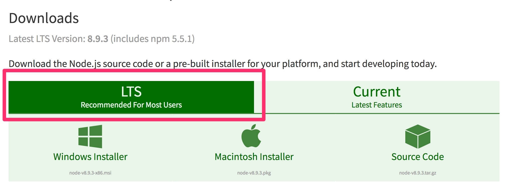
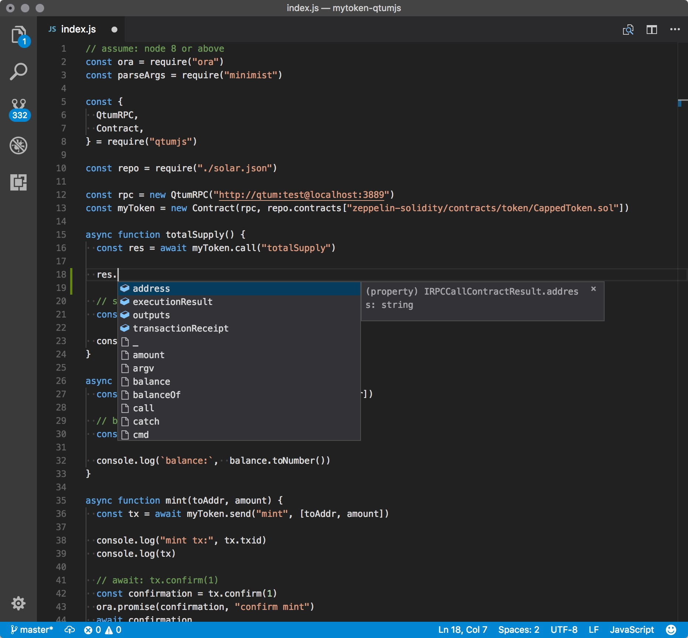
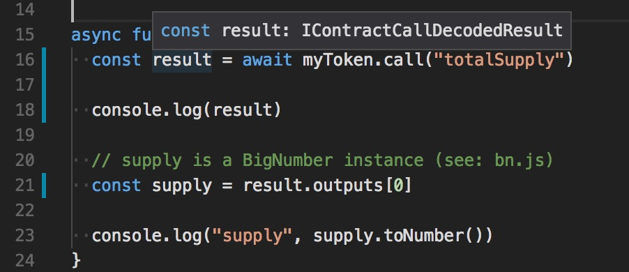

# ERC20与QtumJS

在本章中，我们将使用 [qtumjs](https://github.com/qtumproject/qtumjs)构建一个NodeJS CLI工具，用于和[前面部署的ERC20 token](./erc20-token.md)进行交互。

下载该project代码的链接：[qtumproject/qtumbook-mytoken-qtumjs-cli](https://github.com/qtumproject/qtumbook-mytoken-qtumjs-cli).

目前，qtumjs依赖于`qtumd`的PRC服务，因此必须确保docker容器正在运行：

```
docker run -it --rm \
  --name myapp \
  -v `pwd`:/dapp \
  -p 9899:9899 \
  -p 9888:9888 \
  -p 3889:3889 \
  hayeah/qtumportal
```

## 注意NodeJS的兼容性

`node`的版本需要支持 [async/await](https://blog.risingstack.com/mastering-async-await-in-nodejs/)。如果版本号大于8的基本都是可用的。

本书中使用的版本号是8.6（并不是因为该版本有什么特殊性）：

```
node --version

v8.6.0
```

推荐开发者下载 [Long Term Support](https://nodejs.org/en/download/) 版本(8.9.3):



可以通过进入node REPL来测试是否支持 async/await：

```
$ node
```

然后创建一个async函数：

```
> async () => { }
[AsyncFunction]
```

> 如果出于某种原因，你需要在一个不支持async/await的平台上运行qtumjs，请 [create an issue](https://github.com/qtumproject/qtumjs/issues)。

## 代码编辑器注意事项

对于现代JavaScript开发，本书推荐使用 [VSCode](https://code.visualstudio.com/) 。`qtumjs`的API带有静态类型定义，并且使用VSCode时，不需要UX bloat就能获得一些最有用的IDE特性（例如自动完成类型精确）：



开发者也可以尝试使用 [TypeScript](https://www.typescriptlang.org) ！JavaScript实际上是一种非常强大的语言。TypeScript是一个成熟的版本，但它同样保留了JavaScript语言的灵活性。

接下来，我们回到QTUM :p

# 设置ERC20 CLI Project

首先，复制NodeJS project到目录`mytoken-js`下:

```
git clone https://github.com/qtumproject/qtumbook-mytoken-qtumjs-cli.git mytoken-js
```

该project的dependencies项在`package.json`中列出：

```
{
  ...

  "dependencies": {
    "minimist": "^1.2.0",
    "ora": "^1.3.0",
    "qtumjs": "^1.4.1"
  }
}
```

https://github.com/qtumproject/qtumbook-mytoken-qtumjs-cli/blob/23e6d0c40890075163eefacc0c66b018dc9c8bbc/package.json#L7-L9

安装这些dependencies:

```
npm install
```

> 或者根据开发者的喜好，也可以使用`yarn install` 。 参见： https://yarnpkg.com/en/docs/install

# 获取总供应量

下面，我们尝试获取token的总供应量。运行脚本 [index.js](https://github.com/qtumproject/qtumbook-mytoken-qtumjs-cli/blob/23e6d0c40890075163eefacc0c66b018dc9c8bbc/index.js):

```
node index.js supply

Error: Cannot find module './solar.json'
```

出现上述错误是因为脚本需要加载已部署合约的相关信息。

```js
// Load deployment information generated by solar
const repo = require("./solar.json")

// Contract needs the contract address, owner address, and ABI.
const myToken = new Contract(rpc, repo.contracts[
  "zeppelin-solidity/contracts/token/CappedToken.sol"
])
```

+ `require`函数将`solar.json`作为一个JavaScript对象加载进来。

开发者同样也可以将前面章节中生成的`solar.development.json` 直接链接（或者复制）到project目录下作为`solar.json`:

```
ln -s ~/qtumbook/examples/mytoken/solar.development.json solar.json
```

> 参见示例 [solar.development.json](https://github.com/qtumproject/qtumbook-mytoken-qtumjs-cli/blob/master/solar.development.json.example) 文件

现在再次尝试运行脚本index.js：

```
node index.js supply

supply 14000
```

这样就可以正常工作了。

# 调用一个只读Method

我们通常所说的Solidity method如下：

```
function totalSupply() public view returns(uint256)
```

ABI的定义（从`solar.json`中加载的）如下:

```js
{
  "name": "totalSupply",
  "type": "function",
  "payable": false,
  "inputs": [],
  "outputs": [
    {
      "name": "",
      "type": "uint256",
      "indexed": false
    }
  ],
  "constant": true,
  "anonymous": false
}
```
https://github.com/qtumproject/qtumbook-mytoken-qtumjs-cli/blob/5e2e162efcd8d32971e7fab6d1c843ac1c843933/solar.development.json.example#L46-L60

并使用JavaScript调用该method：

```js
// const myToken = new Contract( ... )

async function totalSupply() {
  const result = await myToken.call("totalSupply")

  // supply is a BigNumber instance (see: bn.js)
  const supply = result.outputs[0]

  console.log("supply", supply.toNumber())
}
```

https://github.com/qtumproject/qtumbook-mytoken-qtumjs-cli/blob/5e2e162efcd8d32971e7fab6d1c843ac1c843933/index.js#L15-L22

* `myToken.call("totalSupply")` 返回一个 [Promise](https://developers.google.com/web/fundamentals/primers/promises)， 并且`await`是一种syntatic sugar，它需要等待异步计算，然后才返回结果。
* 在JavaScript中使用 [BigNumber](https://github.com/indutny/bn.js/) 表示Solidity的numbers (int, uint, etc.)。

`result`对象除了返回值以外，还包含其他有用的信息。

通过`console.log(result)`可将result中的信息打印出来：

```
{ address: 'a778c05f1d0f70f1133f4bbf78c1a9a7bf84aed3',
  executionResult:
   { gasUsed: 21689,
     excepted: 'None',
     newAddress: 'a778c05f1d0f70f1133f4bbf78c1a9a7bf84aed3',
     output: '00000000000000000000000000000000000000000000000000000000000036b0',
     codeDeposit: 0,
     gasRefunded: 0,
     depositSize: 0,
     gasForDeposit: 0 },
  transactionReceipt:
   { stateRoot: '5a0d9cd5df18165c75755f4345ca81da94f9247c1c031171fd6e2ce1a368844c',
     gasUsed: 21689,
     bloom: '0000000000000000000000000000000000000000000000000000000000000000000000000000000000000000000000000000000000000000000000000000000000000000000000000000000000000000000000000000000000000000000000000000000000000000000000000000000000000000000000000000000000000000000000000000000000000000000000000000000000000000000000000000000000000000000000000000000000000000000000000000000000000000000000000000000000000000000000000000000000000000000000000000000000000000000000000000000
0000000000000000000000000000000000000000000000000',
     log: [] },
  outputs: [ <BN: 36b0> ] }
```

如果将鼠标的光标悬停在`result`变量上，就会显示该变量的类型为`IContractCallDecodedResult`:



[IContractCallDecodedResult](https://sourcegraph.com/github.com/qtumproject/qtumjs@803dae6430e27a1903373eb6f2589d055ce16b73/-/blob/src/Contract.ts#L81
) 的类型定义：

```js
export interface IContractCallDecodedResult extends IRPCCallContractResult {
    outputs: any[];
}

export interface IRPCCallContractResult {
    address: string;
    executionResult: IExecutionResult;
    transactionReceipt: {
        stateRoot: string;
        gasUsed: string;
        bloom: string;
        log: any[];
    };
}

export interface IExecutionResult {
    gasUsed: number;
    excepted: string;
    newAddress: string;
    output: string;
    codeDeposit: number;
    gasRefunded: number;
    depositSize: number;
    gasForDeposit: number;
}
```

# 带参数的Method调用

`balance` 子命令可用于查询一个账户上有多少个token：

```
node index.js balance dcd32b87270aeb980333213da2549c9907e09e94

balance: 13700
```

实现该功能的JavaScript代码如下：

```js
async function balanceOf(owner) {
  const res = await myToken.call("balanceOf", [owner])

  // balance is a BigNumber instance (see: bn.js)
  const balance = res.outputs[0]

  console.log(`balance:`,  balance.toNumber())
}
```

https://github.com/qtumproject/qtumbook-mytoken-qtumjs-cli/blob/5e2e162efcd8d32971e7fab6d1c843ac1c843933/index.js#L24-L31

参数是以一个数组的方式传入`balanceOf`。

# Send（发送） VS Call（调用）

令人困惑的是，调用method有两种方法：`send`和`call`。这两个名字都是从以太坊继承而来。一种更详细的区别二者的命名方法可能是，调用`send`是对应“commit”，而调用`call`则对应“query”。

* `call` (或 "query")：以一种仿真的形式，在你自己的本地`qtumd`节点上运行合约代码，并返回结果，但是不会改变区块链。使用call是免费的。
* `send` (或 "commit")：创建一个实际的交易，该交易会在网络上全局地运行代码，并改变区块链。使用send会消耗gas。

下一步，我们将使用qtumjs来铸造一些新的token。由于铸造新的token会改变区块链，因此使用`send`调用方法。


# 调用Send铸造Tokens

`mint`命令通过调用`send`创建一个新的交易来创建新的token。然后等待交易被确认：

```
node index.js mint dcd32b87270aeb980333213da2549c9907e09e94 10000

mint tx: 469d0e6a1e1a421c84cd009b983fc153aa5db7da26fa1f89837f2731fa75586c
{ amount: 0,
  fee: -0.081064,
  confirmations: 0,
  trusted: true,
  txid: '469d0e6a1e1a421c84cd009b983fc153aa5db7da26fa1f89837f2731fa75586c',
  walletconflicts: [],
  time: 1514442911,
  timereceived: 1514442911,
  'bip125-replaceable': 'no',
  details:
   [ { account: '',
       category: 'send',
       amount: 0,
       vout: 0,
       fee: -0.081064,
       abandoned: false } ],
  hex: '02000000014d195e5308764e1f64236c64b8975030dd8b8815d7cfa88ee838c029e64fa03f0200000047463043022052a137063b24e74c3953891230dae739ae3adfa2144c91805de4e46ae7c4b152021f0ccdf1b3e4dd86de7777f437447dd147955e9e112c2607bfd67ddc4e7d6e2001feffffff02000000000000000063010403400d0301284440c10f19000000000000000000000000dcd32b87270aeb980333213da2549c9907e09e94000000000000000000000000000000000000000000000000000000000000271014a778c05f1d0f70f1133f4bbf78c1a9a7bf84aed3c2606ecea8d1010000
1976a914dcd32b87270aeb980333213da2549c9907e09e9488acc3080000',
  method: 'mint',
  confirm: [Function: confirm] }
✔ confirm mint
```

并且可以看到，余额已经增加了：

```
node index.js balance dcd32b87270aeb980333213da2549c9907e09e94

balance: 23700
```

`mint`函数源代码如下：

```js
async function mint(toAddr, amount) {
  const tx = await myToken.send("mint", [toAddr, amount])

  console.log("mint tx:", tx.txid)
  console.log(tx)

  await tx.confirm(1)
}
```

* `tx` 为已经提交的交易。
* `tx.confirm(1)` 是一个Promise，当交易得到1个确认，它就会产生返回值。

# Token转账（Transfer）

我们将token从`dcd32...9e94` 转移到另一个账户。合约的`transfer` method有两个参数：

* `_to` token的接收方地址。
* `_value` 转移的token的数量。

```js
function transfer(address _to, uint256 _value) public returns (bool) {
  require(_to != address(0));
  require(_value <= balances[msg.sender]);

  // SafeMath.sub will throw if there is not enough balance.
  balances[msg.sender] = balances[msg.sender].sub(_value);
  balances[_to] = balances[_to].add(_value);
  Transfer(msg.sender, _to, _value);
  return true;
}
```

注意，该API不需要`_from` 地址。因为`msg.sender`被认为是转移的token的来源。

这里再次出现了`msg.sender`。

我们在 [Owner地址](./erc20-token.html#Owner地址) 一节中提到过，QTUM实际上并没有账户的概念，`msg.sender`就是用于交易支付的UTXO地址。

为了成为`dcb3...9e94`，我们需要显示地指定某个UTXO具有相同的地址。可以通过使用`senderAddress`选项来实现这一点。

```js
async function transfer(fromAddr, toAddr, amount) {
  const tx = await myToken.send("transfer", [toAddr, amount], {
    senderAddress: fromAddr,
  })

  console.log("transfer tx:", tx.txid)
  console.log(tx)

  // or: await tx.confirm(1)
  const confirmation = tx.confirm(1)
  ora.promise(confirmation, "confirm transfer")
  await confirmation
}
```

在上述代码中，`send`的第三个参数可以是由开发者自己指定的`msg.sender`。但是记住要 [prefund](http://localhost:4000/part2/erc20-token.html#prefunding-the-owner-address) （预先发送一些QTUM）到该地址，使其有可用的UTXO。

对于send调用，还有一些其他可以指定的选项。完全地类型定义是 `IContractSendRequestOptions`:

```js
export interface IContractSendRequestOptions {
  /**
   * The amount in QTUM to send. eg 0.1, default: 0
   */
  amount?: number | string

  /**
   * gasLimit, default: 200000, max: 40000000
   */
  gasLimit?: number

  /**
   * Qtum price per gas unit, default: 0.00000001, min:0.00000001
   */
  gasPrice?: number | string

  /**
   * The quantum address that will be used as sender.
   */
  senderAddress?: string
}
```

为了测试 `transfer`功能，我们生成一个新的接收方地址，并将其转换为十六进制格式：

```
qcli getnewaddress
qXuvswhQ9Vjza8AFj1vmUL4N531CDVoWsz

qcli gethexaddress qXuvswhQ9Vjza8AFj1vmUL4N531CDVoWsz
9d748f98e65c6875dbed7bfb6ffbeca426ff9cc6
```

从`dcb3...9e94`地址转移100个token过来：

```
node index.js transfer \
 qdgznat81MfTHZUrQrLZDZteAx212X4Wjj \
 9d748f98e65c6875dbed7bfb6ffbeca426ff9cc6 \
 100

transfer tx: a1ba017b3974b98bf9c8edc824c3abc0ce17678a14e7cfac94b5900a290bdd07
✔ confirm transfer
```

> 注意到发送方的地址必须使用base58地址格式，这一点我们未来会解决。参见：[qtumjs issues#2](https://github.com/qtumproject/qtumjs/issues/2)

然后就可以验证`9d74...9cc6`地址上确实已经接收到了这些token：

```
node index.js balance 9d748f98e65c6875dbed7bfb6ffbeca426ff9cc6

balance: 100
```

并且，原来的账户余额会减少100个token：

```
node index.js balance dcd32b87270aeb980333213da2549c9907e09e94

balance: 23600
```

# 观察合约Events

`CappedToken`合约定义了一些events。无论什么时候当资金从一个账户转移到另一个账户时（也包括铸造新的token时），就会触发`Transfer` event。`Transfer` event如下：

```
event Transfer(
  address indexed from,
  address indexed to,
  uint256 value
);
```

可使用qtumjs订阅合约event流，这样当一个transfer出现的时候我们就可以及时作出反应。实现代码：

```js
async function streamEvents() {
  console.log("Subscribed to contract events")
  console.log("Ctrl-C to terminate events subscription")

  myToken.onLog((entry) => {
    console.log(entry)
  }, { minconf: 1 })
}
```

接下来看看它怎么运转。启动`events`订阅：

```
node index.js events

Subscribed to contract events
Ctrl-C to terminate events subscription
```

该程序挂起，等待新的events出现。在另一个terminal（终端）中，铸造更多的token：

```
node index.js mint dcd32b87270aeb980333213da2549c9907e09e94 10000

mint tx: c0e3007178a1b9e05b33e770f7a0e7d084f2d06732658524be042dc0e9864cc4
```

等待确认。在`events` 所在的terminal上，可以看到`Mint`和`Transfer`events都被打印出来：

```
{ blockHash: 'd8135a1a0e4cddb82a6912fc7eb2bd7f717b7e85069dc2fa3b8f0f8c02acbd17',
  blockNumber: 2372,
  transactionHash: 'c0e3007178a1b9e05b33e770f7a0e7d084f2d06732658524be042dc0e9864cc4',
  transactionIndex: 2,
  from: 'dcd32b87270aeb980333213da2549c9907e09e94',
  to: 'a778c05f1d0f70f1133f4bbf78c1a9a7bf84aed3',
  cumulativeGasUsed: 39306,
  gasUsed: 39306,
  contractAddress: 'a778c05f1d0f70f1133f4bbf78c1a9a7bf84aed3',
  topics:
   [ '0f6798a560793a54c3bcfe86a93cde1e73087d944c0ea20544137d4121396885',
     '000000000000000000000000dcd32b87270aeb980333213da2549c9907e09e94' ],
  data: '0000000000000000000000000000000000000000000000000000000000002710',
  event:
   { type: 'Mint',
     to: '0xdcd32b87270aeb980333213da2549c9907e09e94',
     amount: <BN: 2710> } }
{ blockHash: 'd8135a1a0e4cddb82a6912fc7eb2bd7f717b7e85069dc2fa3b8f0f8c02acbd17',
  blockNumber: 2372,
  transactionHash: 'c0e3007178a1b9e05b33e770f7a0e7d084f2d06732658524be042dc0e9864cc4',
  transactionIndex: 2,
  from: 'dcd32b87270aeb980333213da2549c9907e09e94',
  to: 'a778c05f1d0f70f1133f4bbf78c1a9a7bf84aed3',
  cumulativeGasUsed: 39306,
  gasUsed: 39306,
  contractAddress: 'a778c05f1d0f70f1133f4bbf78c1a9a7bf84aed3',
  topics:
   [ 'ddf252ad1be2c89b69c2b068fc378daa952ba7f163c4a11628f55a4df523b3ef',
     '0000000000000000000000000000000000000000000000000000000000000000',
     '000000000000000000000000dcd32b87270aeb980333213da2549c9907e09e94' ],
  data: '0000000000000000000000000000000000000000000000000000000000002710',
  event:
   { type: 'Transfer',
     from: '0x0000000000000000000000000000000000000000',
     to: '0xdcd32b87270aeb980333213da2549c9907e09e94',
     value: <BN: 2710> } }
```

> 如果开发者运行的是自己的qtumd节点，而不是提供的docker镜像，那么开发者需要启动`-logevents`以使events日志工作。参见：[qtum-docker/dapp](https://github.com/hayeah/qtum-docker/blob/b6a556033a91ce7a60c40a3f7dfc6742d2c9a761/dapp/qtumd-launch#L25)。

# 总结

在本章中，我们开发了一个简单的NodeJS CLI工具，用于和ERC20合约进行交互。

+ qtumjs是一个基于Promise的API。使用async/await编写干净的异步代码。
+ 调用`call`类似于“query”，而调用`send`类似于“commit”。
+ 在调用`call`或`send`时，使用`senderAddress`指定`msg.owner`。

现在你们已经知道怎样使用qtumjs，可以准备构建DApp了。
